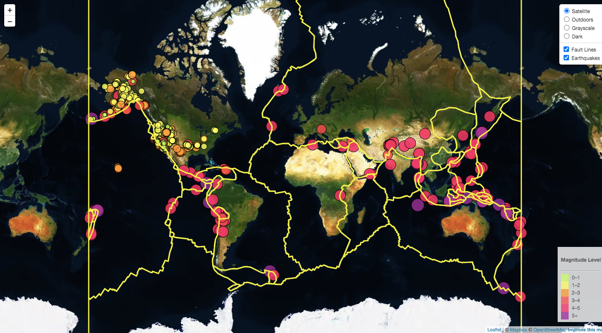

# Leaflet-Challenge

## Level-1: Basic Visualization

### DataSet
Earthquake data for the last 7 days is used for the visualization. The data is taken as a JSON format from the [USGS](http://earthquake.usgs.gov/earthquakes/feed/v1.0/geojson.php), which is updated every 5 minutes.

### Visualization
Creating a map using Leaflet that plots all of the earthquakes from your data set based on their longitude and latitude.

The visualzation includes
   * Data markers which reflect the magnitude of the earthquake in their size and color. Earthquakes with higher magnitudes appear larger and darker in color.

   * Popups that provide additional information about the earthquake when a marker is clicked.

   * A legend that will provide context for your map data.

The Level-1 page can be accessed [here](https://jua91.github.io/Leaflet-Challenge/Leaflet-Step-1/index.html)

## Level-2: Advanced Visualization

### Additional dataset
[Tectonic plates](https://github.com/fraxen/tectonicplates) were added in this map in order to illustrate the relationship between tectonic plates and seismic activity.

### Visualization

* A base map object with 4 map layers to choose from was added 
* An overlay map which contains plates layer and geoJSON layer was also added.
* Layer controls to our map was created.

The Level-2 page can be accessed [here](https://jua91.github.io/Leaflet-Challenge/Leaflet-Step-2/index.html)
